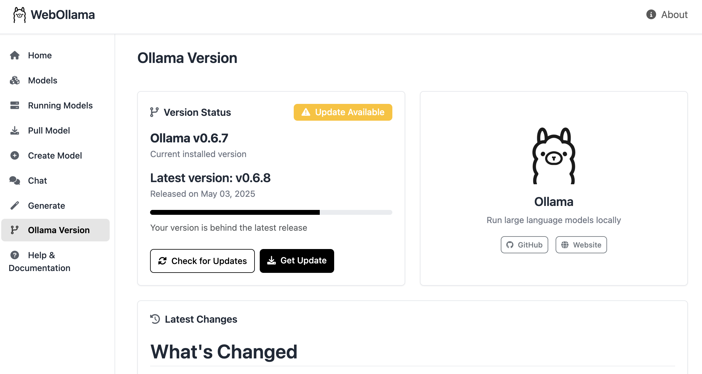

# WebOllama

A web interface for managing Ollama models and generating text using Python Flask and Bootstrap.

## Features

- View and manage local Ollama models
- Pull new models from the Ollama library
- Create custom models with system prompts
- Chat with Ollama models with conversation history
- Generate text completions with customizable parameters
- View and unload models currently running in memory
- Monitor model resource usage and expiration
- Compare model versions and check for updates
- Display real-time changelog from GitHub releases
- Responsive UI with modern design for desktop and mobile

## Screenshots

### Home Page


### Models Page


### Version & Updates



## Installation

### Prerequisites

- Python 3.7 or higher
- [Ollama](https://ollama.ai/) installed and running

### Setup (Standard)

1. Clone this repository
```bash
git clone https://github.com/username/webollama.git
cd webollama
```

2. Run the setup script
```bash
./setup.sh
```

3. Or manually set up:
```bash
# Create virtual environment
python -m venv .venv
source .venv/bin/activate  # On Windows: .venv\Scripts\activate

# Install dependencies
pip install -r requirements.txt

# Create a .env file (optional)
echo "SECRET_KEY=your-secret-key" > .env
echo "OLLAMA_API_BASE=http://localhost:11434" >> .env
```

### Setup (Docker)

#### Option 1: Connect to local Ollama instance

```bash
# Build and run the WebOllama container only
docker-compose up -d
```

#### Option 2: Run both Ollama and WebOllama in containers

```bash
# Run both Ollama and WebOllama containers
docker-compose -f docker-compose.ollama.yml up -d
```

## Usage

1. Make sure Ollama is running on your system

2. Start the web interface (if not using Docker)
```bash
python app.py
```

3. Open your browser and navigate to:
   - Standard install: `http://127.0.0.1:5000`
   - Docker: `http://127.0.0.1:5000`

## Features in Detail

### Model Management
- List, view details, and delete models
- Pull models from the Ollama library
- Create custom models with system prompts
- Customize model template and parameters
- Sort models by name, size, or modification date
- Monitor running models and resource usage
- Unload models from memory

### Generation & Chat
- Interactive chat interface with persistent conversation history
- Text generation with parameter customization
- Adjust temperature, top_p, top_k and other parameters
- Real-time streaming responses
- Preset parameters for different generation styles

### Version & Updates
- View current Ollama version
- Check for updates with real-time API calls
- View detailed changelog from GitHub releases
- Access download links for latest updates

## Configuration

The application can be configured using environment variables or a `.env` file:

- `SECRET_KEY`: Flask secret key for sessions (default: a development key)
- `OLLAMA_API_BASE`: Base URL of the Ollama API (default: `http://127.0.0.1:11434`)
- `PORT`: Port to run the web interface on (default: `5000`)
- `HOST`: Host to bind the web interface to (default: `127.0.0.1`)

If running with Docker, you can modify the ports and configuration in the Docker Compose files.

## Contributing

Contributions are welcome! Please feel free to submit a Pull Request.

1. Fork the repository
2. Create your feature branch (`git checkout -b feature/amazing-feature`)
3. Commit your changes (`git commit -m 'Add some amazing feature'`)
4. Push to the branch (`git push origin feature/amazing-feature`)
5. Open a Pull Request

## License

MIT

## Acknowledgements

- [Ollama](https://ollama.ai/) for the amazing local LLM server
- [Flask](https://flask.palletsprojects.com/) for the web framework
- [Bootstrap](https://getbootstrap.com/) for the frontend components